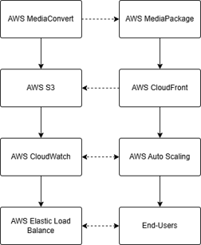

# AWS Scalable Video Streaming Platform

## Overview

This project presents the design of a scalable video streaming platform built on AWS cloud services. The architecture focuses on scalability, high availability, low-latency content delivery, disaster recovery, and cost optimization for global video streaming workloads.

The platform leverages AWS Media Services, CloudFront, Auto Scaling, and Load Balancing to efficiently deliver video content while maintaining performance during periods of high traffic demand.

---

## Architecture

The architecture integrates AWS MediaConvert, MediaPackage, CloudFront, S3, CloudWatch, Auto Scaling, and Elastic Load Balancing to provide a scalable and resilient streaming solution.

Key architectural features include:

* Content delivery through AWS CloudFront
* Video processing with AWS Media Services
* Dynamic scaling using AWS Auto Scaling
* Load distribution through Elastic Load Balancing
* Monitoring and observability with CloudWatch
* Secure storage using Amazon S3
* Disaster recovery and high-availability planning

---

## Technologies Used

* AWS MediaConvert
* AWS MediaPackage
* AWS CloudFront
* AWS Auto Scaling
* Elastic Load Balancing (ELB)
* AWS Lambda
* Amazon S3
* AWS CloudWatch
* AWS IAM

---

## Project Objectives

* Deliver video content with low latency
* Support traffic spikes through automatic scaling
* Improve availability through multi-AZ architecture
* Optimize infrastructure costs
* Implement disaster recovery strategies
* Enhance scalability and system resilience

---

## My Contributions

As Team Leader, I was responsible for:

* Coordinating project activities and deliverables
* Designing scalability strategies
* Planning disaster recovery approaches
* Defining Auto Scaling configurations
* Designing Load Balancing architecture
* Reviewing and finalizing project documentation

---

## Key Findings

* AWS Media Services provide a scalable solution for video streaming workloads.
* CloudFront significantly improves content delivery performance.
* Auto Scaling helps manage fluctuating traffic demands efficiently.
* Multi-AZ deployments improve availability and fault tolerance.
* Cost optimization requires balancing performance, scalability, and infrastructure expenses.

---

## Repository Contents

* `report.pdf` – Final project report
* `architecture-diagram.png` – AWS architecture diagram
* `cost-analysis.png` – Cost comparison across architectures
* `traffic-growth.png` – Projected traffic growth analysis
* `aws-cost-breakdown.png` – Infrastructure cost breakdown
* `security-availability-features.png` – Security and availability considerations

---

## Academic Information

**Course:** CS519 – Cloud Computing Overview
**Program:** Master of Computer Science
**Institution:** City University of Seattle

---

## Project Type

Academic Team Project
